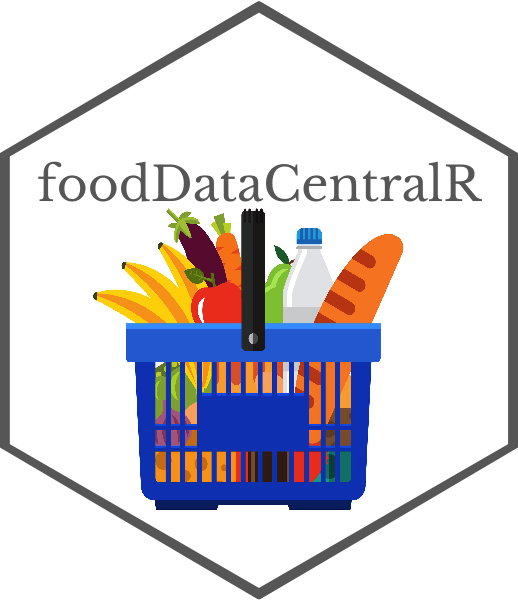

# foodDataCentralR    
<a href='https://www.freepik.com/vectors/food'>Food vector created by iconicbestiary - www.freepik.com</a>  

Search and retrieve data from the United States Department of Agriculture's FoodData Central Database (https://fdc.nal.usda.gov/api-guide.html).  

## Code of Conduct
  
  Please note that the foodDataCentralR project is released with a [Contributor Code of Conduct](https://contributor-covenant.org/version/2/0/CODE_OF_CONDUCT.html). By contributing to this project, you agree to abide by its terms.  
  
  
